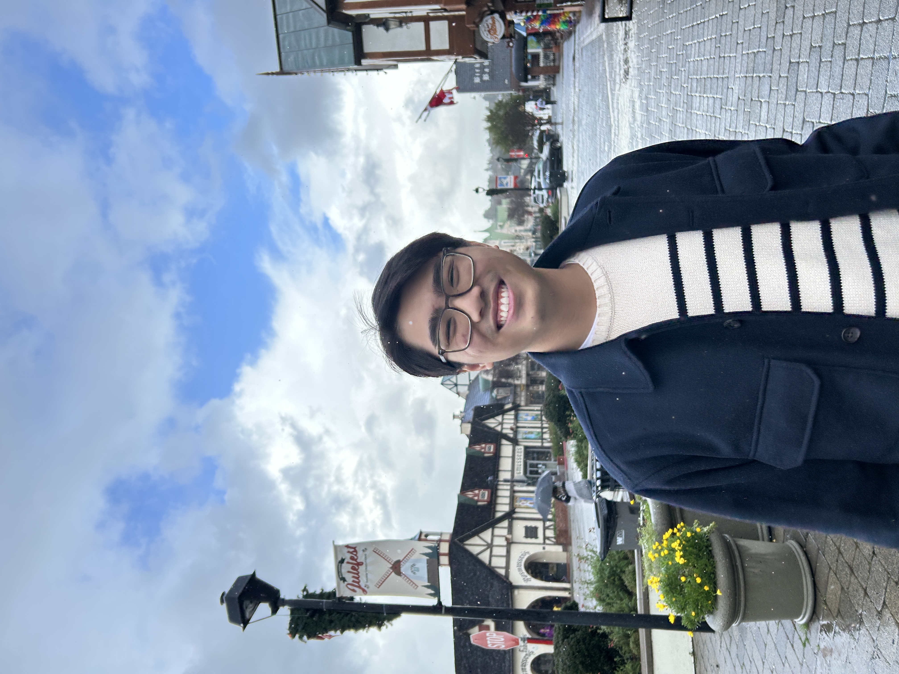

# Kyle Ngo
## I am a rising sophomore at UC Berkeley, studying Data Science and Media Studies and writing for The Daily Californian.

## Skills
1. Sportswriting
2. Adobe Creative Cloud
3. Python
 

| Employer         | Job Description                                                                                                                                           |
|------------------|-----------------------------------------------------------------------------------------------------------------------------------------------------------|
| Daily Cal        | * Write weekly articles previewing and recapping Cal sports, such as Men's basketball * Coordinate with editors * Produce individual opinion pieces |
| KALX             | * Operate baseball, basketball, and football game broadcasts from the station * Collaborate on a biweekly 30-minute talk show                          |
| Prowler Yearbook | * Spearheaded production of 40-page Sports section in the yearbook * Communicated with coaches and athletic director on campus                         |
